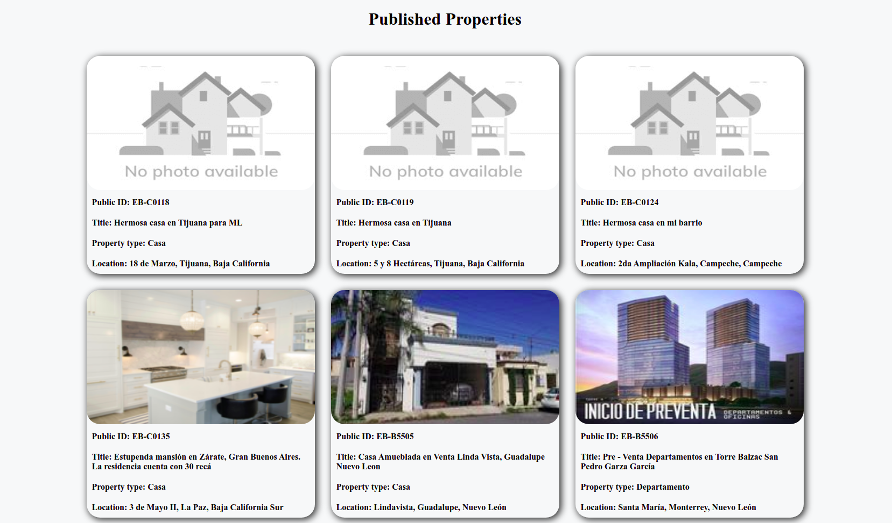
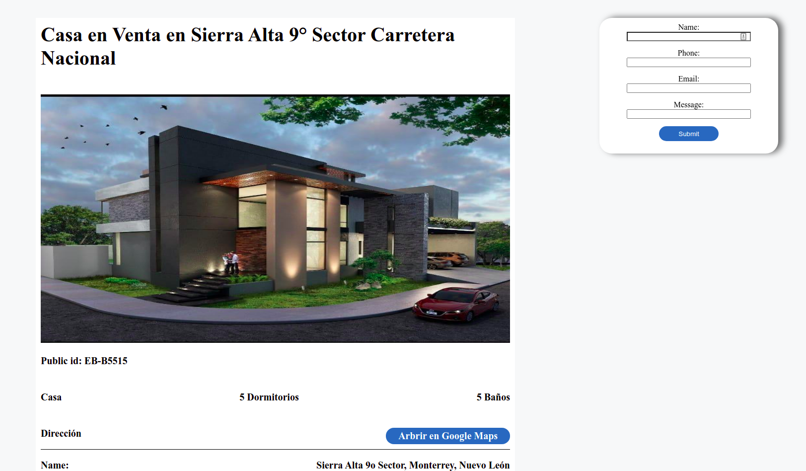

# EasyBroker interview 
## Installation steps

 1. Use python 3.8 
 2. virtualenv -p python3.8 venv and then init virtualenv
 3. Install dependencies: pip3 install -r requirements.txt
 4. Run dev server: python3 manage.py runserver
 5. (Optional) Run tests: python3 manage.py test

 ## Images

## Notes
En cuanto a la UI, simplemente fue un código html y css sencillo para mostrar la información.

Referente al código python en sí, se creó dos aplicaciones de Django, una para hacer las peticiones a la API de EasyBroker así como los tests de estas peticiones, y otra aplicación para manejar la visualización de las páginas y de la información obtenida de la API. 
Resaltar que la información al venir de una API externa y no de modelos del propio proyecto, tiene retraso en hacer las peticiones y luego mostrar la información, tardando quizás más tiempo del ideal. 

-   **What was the hardest thing you had to solve while building the website?**

Lo más complicado fue implementar la vista del formulario, de manera que muestre el detalle de la propiedad en cuestión y aparte tuviera un formulario flotante para contactar con el vendedor. La razón de esto, viene que el propio FormView de Django, no conserva los url params en el context, es decir, el ID de la propiedad que se quería visualizar, se perdía dentro del propio contexto del FormView. Para solucionar dicha problemática, simplemente se obtuvo la url de la página y de esta se extrajo el ID.

Ejemplo, la url del detalle sería **detail/ED-XXX1**, entonces con el objeto request se obtiene esta url, se hace un split con "/" y se extrae el último índice (que viene a ser el ID). Teniendo este ID, ya se puede proseguir y hacer las peticiones pertinentes

Fue complicado, no por la lógica en sí, ya que es algo intuitivo y rápido de solventar, sino porque dicha solución no terminó de convencer, ya que en temas de escalabilidad, podría generar problemas si se decide cambiar el formato de las URL. Otra opción era emplear query params, sin embargo, quedaba anti intuitivo con respecto al esquema de la URL.

-   **Are there any areas of your code that you think isn't that "clean"?**

Excluyendo el diseño UI, los temas que no me acaban de convencer, es el tiempo que toma en hacer las peticiones a la API de la lista de propiedades y lo mencionado anteriormente de obtener el ID de la propiedad desde la URL. A su vez, algo que podría ayudar en los tests (en especial el de contacto) es al momento de crear un mensaje con éxito, podría ser bueno que devolviera el mismo objeto de mensaje que fue creado. De esta manera podría crearse un test para confirmar que el mensaje creado, tiene la misma información enviada en el body al endpoint.
